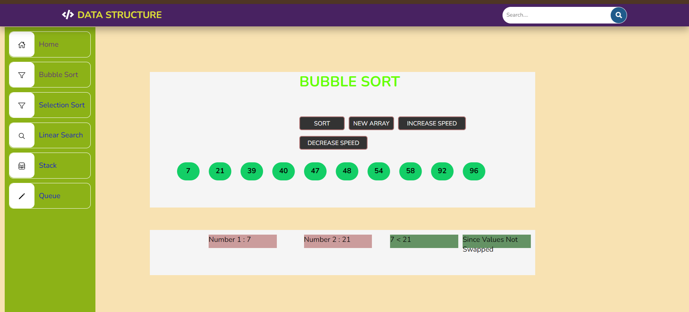
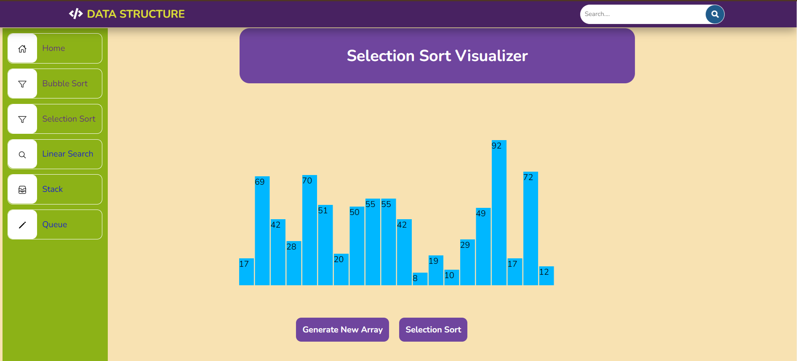
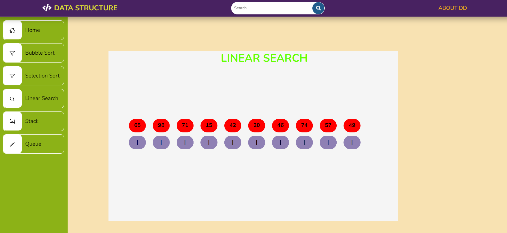
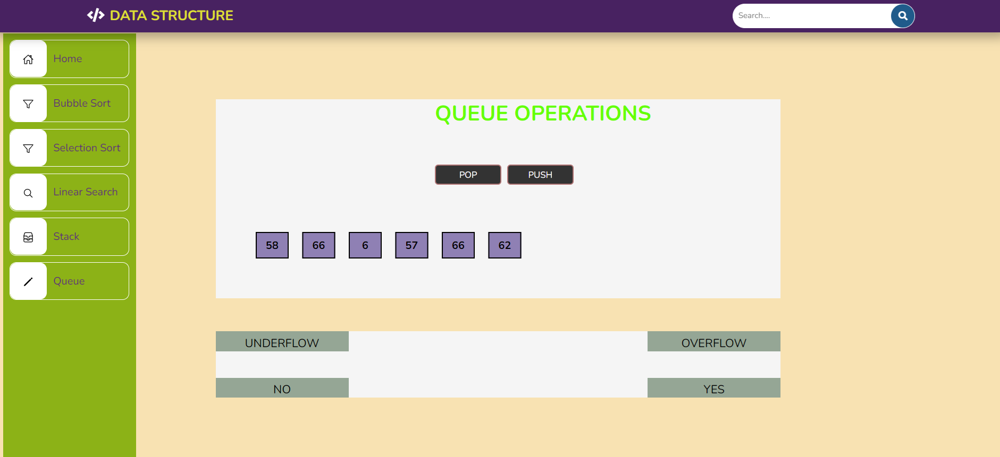

# 📊 Data Structure Visualization

Welcome to the Data Structure Visualization project! This repository provides interactive visualizations of various data structures and algorithms commonly studied in computer science.

## 🌟 Overview

Explore interactive visualizations for understanding the operations and behaviors of essential data structures and algorithms:

- **Stack**: Demonstrates the Last In First Out (LIFO) principle.
- **Queue**: Illustrates the First In First Out (FIFO) principle.
- **Bubble Sort**: Visualizes the bubble sort algorithm for sorting elements.
- **Selection Sort**: Shows the selection sort algorithm in action.
- **Linear Search**: Demonstrates the linear search algorithm for finding elements.

## 🖼️ Visualizations

### 🔄 Bubble Sort Visualization

### 🎯 Selection Sort Visualization

### 🔍 Linear Search Visualization

### 📚 Stack Visualization

### 🧊 Queue Visualization

## 🚀 Getting Started

To start exploring the visualizations:

1. **Navigate to the respective links** provided below:
   - [Home](index.html): Navigate back to the home page.
   - [Bubble Sort](Bubble_sort/Bubble_Sort.html): Visualize the Bubble Sort algorithm.
   - [Selection Sort](selection%20sort/Selection_sort.html): Explore the Selection Sort algorithm.
   - [Linear Search](linear%20search/linear.html): Learn about the Linear Search algorithm.
   - [Stack](stack/stack.html): Experience how a Stack data structure works.
   - [Queue](queue/queue.html): Understand the operations of a Queue data structure.

2. **Interact** with the visualizations to understand how each data structure or algorithm operates.

3. **Compare** different algorithms or data structures side-by-side to see their differences in action.

## 🤝 Contributing

Contributions to enhance or add more visualizations are welcome! If you have ideas or improvements, please refer to the [Contributing](#contributing) section in the README.

## 📢 Feedback

If you have any feedback, suggestions, or encounter issues with the visualizations, please let us know by [opening an issue](https://github.com/yourusername/yourrepository/issues). Your feedback helps us improve the project for everyone.

## 🌟 Authors

This project is maintained by DreamDevelopers. You can find us on [GitHub](https://github.com/dreamdevelopers).
